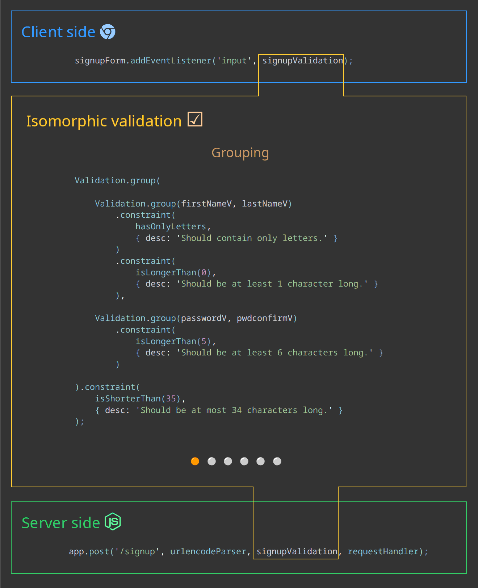

# isomorphic-validation

## An isomorphic form validation javascript library which runs the same code both client and server side and allows for reusing validation logic for the same fields on different forms.

 

## 🕙 Developing ...

 

## Documentation
[ isomorphic-validation-docs](https://itihon.github.io/isomorphic-validation/)

 

## API overview:

## Core module "isomorphic-validation"

The core module of the library exports two entities: [`Validation`](https://itihon.github.io/isomorphic-validation/api/validation/constructor/) and [`Predicate`](https://itihon.github.io/isomorphic-validation/api/predicate/constructor/).

### Instance methods:

<table>
<tr>
<td>

- [`Validation().started()`](https://itihon.github.io/isomorphic-validation/api/validation/instance-methods/started/)
- [`Validation().valid()`](https://itihon.github.io/isomorphic-validation/api/validation/instance-methods/valid/)
- [`Validation().invalid()`](https://itihon.github.io/isomorphic-validation/api/validation/instance-methods/invalid/)
- [`Validation().changed()`](https://itihon.github.io/isomorphic-validation/api/validation/instance-methods/changed/)
- [`Validation().validated()`](https://itihon.github.io/isomorphic-validation/api/validation/instance-methods/validated/)
- [`Validation().error()`](https://itihon.github.io/isomorphic-validation/api/validation/instance-methods/error/)
- [`Validation().constraint()`](https://itihon.github.io/isomorphic-validation/api/validation/instance-methods/constraint/)
- [`Validation().bind()`](https://itihon.github.io/isomorphic-validation/api/validation/instance-methods/bind/)
- [`Validation().dataMapper()`](https://itihon.github.io/isomorphic-validation/api/validation/instance-methods/datamapper/)
- [`Validation().validate()`](https://itihon.github.io/isomorphic-validation/api/validation/instance-methods/validate/)

</td>
<td>

- [`Predicate().started()`](https://itihon.github.io/isomorphic-validation/api/predicate/instance-methods/started/)
- [`Predicate().valid()`](https://itihon.github.io/isomorphic-validation/api/predicate/instance-methods/valid/)
- [`Predicate().invalid()`](https://itihon.github.io/isomorphic-validation/api/predicate/instance-methods/invalid/)
- [`Predicate().changed()`](https://itihon.github.io/isomorphic-validation/api/predicate/instance-methods/changed/)
- [`Predicate().validated()`](https://itihon.github.io/isomorphic-validation/api/predicate/instance-methods/validated/)
- [`Predicate().error()`](https://itihon.github.io/isomorphic-validation/api/predicate/instance-methods/error/)
- [`Predicate().restored()`](https://itihon.github.io/isomorphic-validation/api/predicate/instance-methods/restored/)

</td>
</tr>
</table>

### Instance properties:

<table>
<tr>
<td>

- [`Validation().client`](https://itihon.github.io/isomorphic-validation/api/validation/instance-properties/client/)
- [`Validation().server`](https://itihon.github.io/isomorphic-validation/api/validation/instance-properties/server/)
- [`Validation().isomorphic`](https://itihon.github.io/isomorphic-validation/api/validation/instance-properties/isomorphic/)
- [`Validation().isValid`](https://itihon.github.io/isomorphic-validation/api/validation/instance-properties/is-valid/)
- [`Validation().constraints`](https://itihon.github.io/isomorphic-validation/api/validation/instance-properties/constraints/)
- [`Validation().validations`](https://itihon.github.io/isomorphic-validation/api/validation/instance-properties/validations/)

</td>
<td>

- [`Predicate().client`](https://itihon.github.io/isomorphic-validation/api/predicate/instance-properties/client/)
- [`Predicate().server`](https://itihon.github.io/isomorphic-validation/api/predicate/instance-properties/server/)
- [`Predicate().isomorphic`](https://itihon.github.io/isomorphic-validation/api/predicate/instance-properties/isomorphic/)

</td>
</tr>
</table>

### Static methods:

<table>
<tr>
<td>

- [`Validation.group()`](https://itihon.github.io/isomorphic-validation/api/validation/static-methods/group/)
- [`Validation.glue()`](https://itihon.github.io/isomorphic-validation/api/validation/static-methods/glue/)
- [`Validation.clone()`](https://itihon.github.io/isomorphic-validation/api/validation/static-methods/clone/)
- [`Validation.profile()`](https://itihon.github.io/isomorphic-validation/api/validation/static-methods/profile/)

</td>
</tr>
<table>

 

### Validation object

A `Validation` object can be created several ways:

- a [single](https://itihon.github.io/isomorphic-validation/concept/single-validation/) `Validation` is created by the [constructor](https://itihon.github.io/isomorphic-validation/api/validation/constructor/) function.
- a [grouping](https://itihon.github.io/isomorphic-validation/concept/grouping-validations/) `Validation` is created by the static methods [`Validation.group()`](https://itihon.github.io/isomorphic-validation/api/validation/static-methods/group/) and [`Validation.glue()`](https://itihon.github.io/isomorphic-validation/api/validation/static-methods/glue/)
- also a [grouping](https://itihon.github.io/isomorphic-validation/concept/grouping-validations/) `Validation` with nested (grouped), bound to form fields `Validation` objects is created by the [`Validation.profile()`](https://itihon.github.io/isomorphic-validation/api/validation/static-methods/profile/) static method.
- and lastly, a [single](https://itihon.github.io/isomorphic-validation/concept/single-validation/) `Validation` is created by the [`Validation.clone()`](https://itihon.github.io/isomorphic-validation/api/validation/static-methods/clone/) method from another `Validation`.

Nested (grouped) `Validation` objects are accessed through: 

- the [`Validation().validations`](https://itihon.github.io/isomorphic-validation/api/validation/instance-properties/validations/) property.
- by form field names when created using the [`Validation.profile()`](https://itihon.github.io/isomorphic-validation/api/validation/static-methods/profile/) method.

 

### Predicate object

A `Predicate` object can be created:

- by the [constructor](https://itihon.github.io/isomorphic-validation/api/predicate/constructor/) function.
- cloned from another `Predicate` object when passed into the [constructor](https://itihon.github.io/isomorphic-validation/api/predicate/constructor/#cloning-a-predicate) function.

`Predicate` objects added to validations can be accessed:

- through the [`Validation().constraints`](https://itihon.github.io/isomorphic-validation/api/validation/instance-properties/constraints/) property.
- in [state callbacks](https://itihon.github.io/isomorphic-validation/concept/state-callbacks/) through the [`ValidationResult`](https://itihon.github.io/isomorphic-validation/api/validation-result/) object passed in.

 

## UI module "isomorphic-validation/ui"

The UI module exports the following set of helper, renderer and effect functions for performing UI side effects:

### Helper functions

- [`firstInvalid()`](https://itihon.github.io/isomorphic-validation/api/ui/helper-functions/first-invalid/)
- [`allInvalid()`](https://itihon.github.io/isomorphic-validation/api/ui/helper-functions/all-invalid/)
- [`toEventHandler()`](https://itihon.github.io/isomorphic-validation/api/ui/helper-functions/to-event-handler/)
- [`createApplyEffect()`](https://itihon.github.io/isomorphic-validation/api/ui/helper-functions/create-apply-effect/)

### Renderer functions 

- [`renderFirstError()`](https://itihon.github.io/isomorphic-validation/api/ui/renderer-functions/render-first-error/)
- [`renderAllErrors()`](https://itihon.github.io/isomorphic-validation/api/ui/renderer-functions/render-all-errors/)
- [`renderProperty()`](https://itihon.github.io/isomorphic-validation/api/ui/renderer-functions/render-property/)

### Effect functions

- [`applyClass()`](https://itihon.github.io/isomorphic-validation/api/ui/effect-functions/apply-class/)
- [`applyOutline()`](https://itihon.github.io/isomorphic-validation/api/ui/effect-functions/apply-outline/)
- [`applyBackground()`](https://itihon.github.io/isomorphic-validation/api/ui/effect-functions/apply-background/)
- [`applyAccess()`](https://itihon.github.io/isomorphic-validation/api/ui/effect-functions/apply-access/)
- [`applyBox()`](https://itihon.github.io/isomorphic-validation/api/ui/effect-functions/apply-box/)